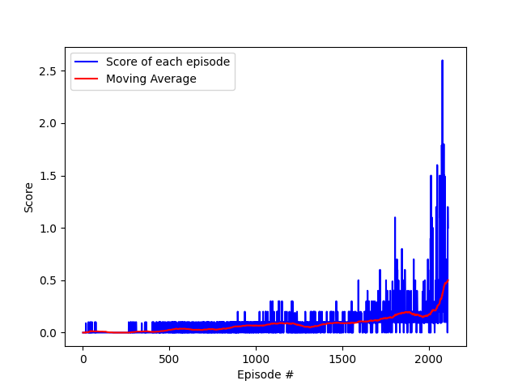

# Report

## Learning algorithm

As a learning algorithm, **Deep Deterministic Policy Gradient (DDPG)** was used, similarly as in the second [project](https://github.com/thebambooguy/continuous_control). 
DDPG can be seen as a Deep Q-network for continuous action spaces. It is an Actor-Critic algorithm, where the actor decides which action should be taken and 
the critic informs how good this action was. Both Actor and Critic are represented by neural networks and each of them 
has a copy, similarly as in DQN (Target Network). However, in DDPG the actor directly maps states to action instead of 
outputting the probability distribution across a discrete action space.

When it comes to exploration in continuous action spaces, we need to do it differently. For such environments,
exploration is done by adding noise to the action. In the DDPG paper, authors have used Ornstein-Uhlenbeck process
and the same method was implemented in this project. Changing parameters like `mu`, `theta`, `sigma` affects
exploration of the algorithm. 

In this project, we have two agents in our environment. What is important is that each agent receives its own, local 
observation. Thus, we can easily adapt the code to simultaneously train both agents through self-play. We can 
select action and explore the environment with each agent independently, and we should be able to solve the environment. 
As one of the improvements, we can create shared replay buffer, as both agents will have similar experiences.

### Hyperparameters

Following values of hyperparameters were chosen:
- max_t: 1500
- actor_lr: 2e-4
- critic_lr: 2e-4
- weight_decay: 0
- buffer_size: int(1e8)
- batch_size: 256
- gamma: 0.99
- tau: 1e-3
- mu: 0.
- theta: 0.15
- sigma: 0.1
- fc1_units: 256
- fc2_units: 128

## Plot of rewards

In order to solve the environment, our agents must get an average score of +0.5 (over 100 consecutive episodes, after 
taking the maximum over both agents). Two separate DDPG agents with shared replay buffer were able to solve the environment 
in 2012 episodes, receiving average score equal to 0.501. Plot of the rewards can be found below.

## Ideas for future work
- Using same actor network to select actions for each agent
- Performing deeper analysis of hyperparameters
- Improving DDPG via Prioritized Experience Replay
- Using Twin-Delayed DDPG (TD3), which introduces double learning technique to DDPG and avoids overestimation of Q-values
